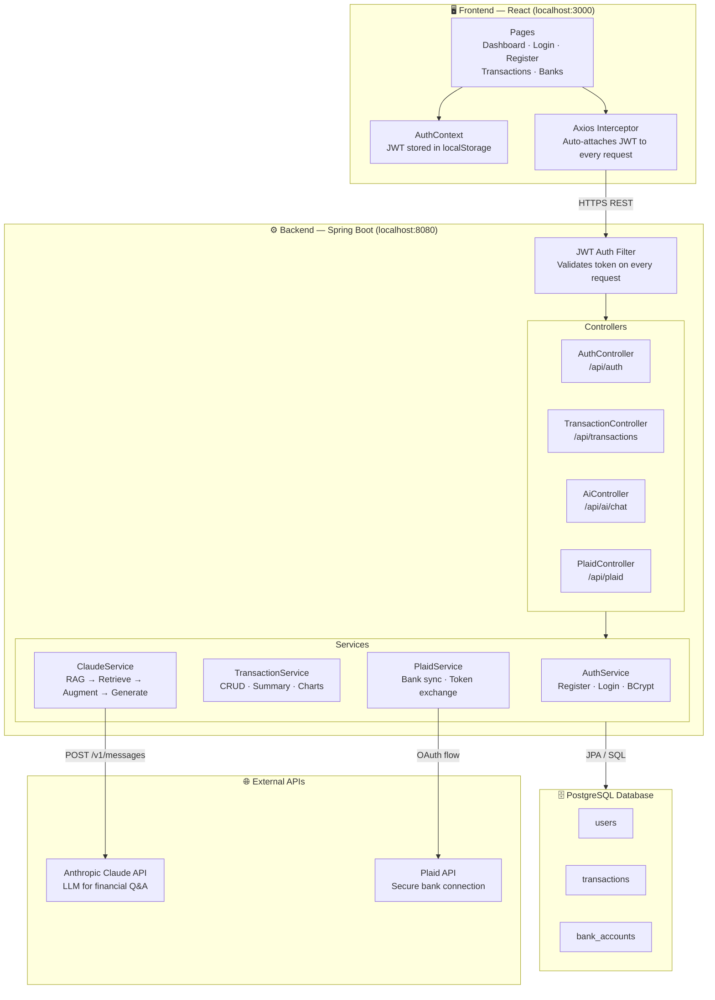
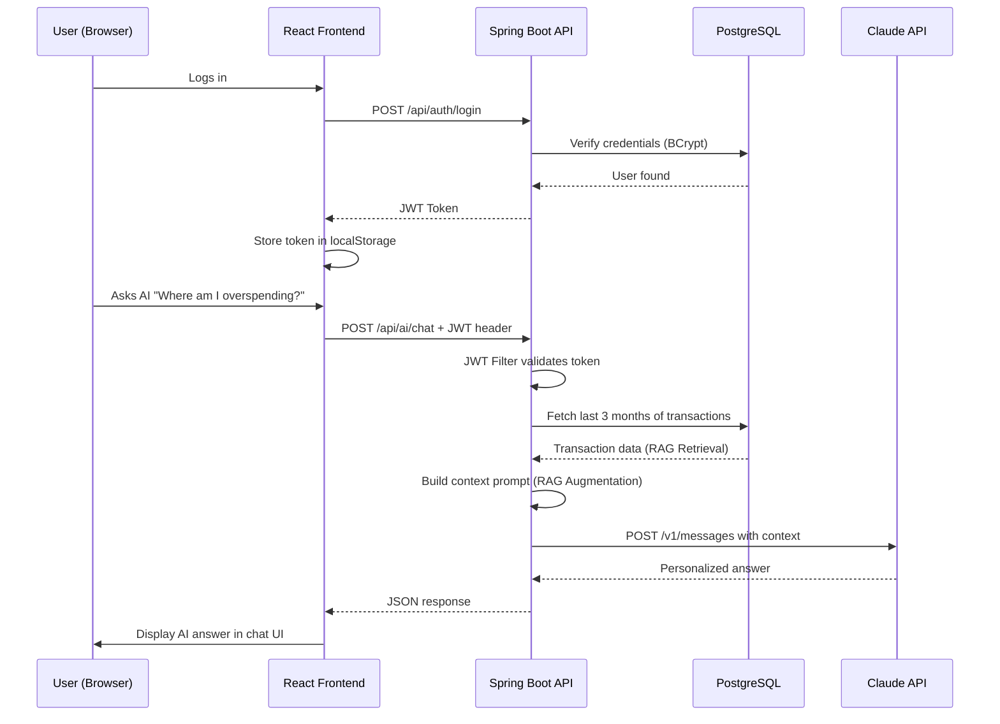

# 💰 BudgetWise

A full-stack personal finance application that helps you track income and expenses, visualize spending patterns, connect your bank account, and get AI-powered financial insights using natural language.

---

## ✨ Features

- **Secure Authentication** — Register and login with JWT-based auth. Passwords are BCrypt encrypted.
- **Transaction Management** — Add, edit, and delete income and expense transactions with categories and dates.
- **Monthly Spending Chart** — Visual bar chart with average line showing spending trends across all months.
- **Category Breakdown** — See which spending categories cost you the most.
- **Bank Sync via Plaid** — Connect your real bank account and auto-import transactions securely.
- **AI Financial Assistant** — Ask questions in plain English like *"Where am I overspending?"* and get answers based on your actual data, powered by Claude AI and RAG.
- **Persistent Storage** — All data stored in PostgreSQL, survives restarts.

---

## 🛠️ Tech Stack

### Frontend
| Technology | Purpose |
|---|---|
| React 18 | UI framework |
| React Router v6 | Client-side routing |
| Axios | HTTP client with JWT interceptors |
| Recharts | Charts and data visualization |
| React Plaid Link | Bank connection UI |

### Backend
| Technology | Purpose |
|---|---|
| Spring Boot 3.2 | REST API framework |
| Spring Security | Authentication & authorization |
| JWT (JJWT) | Stateless token-based auth |
| Spring Data JPA | Database ORM |
| PostgreSQL | Persistent relational database |
| Lombok | Boilerplate reduction |
| Plaid Java SDK | Bank integration |

### AI / RAG
| Technology | Purpose |
|---|---|
| Anthropic Claude API | Language model for financial Q&A |
| RAG Pattern | Retrieves user's real transaction data, injects into prompt, generates personalized answers |

---

## 🏗️ Architecture

### High-Level Diagram



---

### Request Flow



---

### Component Breakdown

```
BudgetTracker/
│
├── 🖥️  FRONTEND (React)
│   ├── AuthContext        → Global JWT state, login/logout
│   ├── Axios Interceptor  → Auto JWT header + 401 redirect
│   ├── Pages              → Dashboard, Login, Register, Banks, Transactions
│   └── Components         → Charts, Forms, Cards, AI Chat
│
└── ⚙️  BACKEND (Spring Boot)
    ├── JWT Filter          → Secures every endpoint
    ├── AuthController      → /register, /login
    ├── TransactionController → CRUD + monthly/summary/top-expenses
    ├── AiController        → /chat (RAG pipeline)
    ├── PlaidController     → Bank link, sync, disconnect
    ├── PostgreSQL (JPA)    → users, transactions, bank_accounts
    └── External APIs       → Anthropic Claude · Plaid
```

---

## 🚀 Getting Started

### Prerequisites
- Java 17 (Temurin recommended)
- Node.js 18+
- PostgreSQL 16+
- Maven 3.9+

### 1. Clone the repo
```bash
git clone https://github.com/your-username/BudgetTracker.git
cd BudgetTracker
```

### 2. Set up PostgreSQL
```bash
createdb budgettracker
```

### 3. Configure environment variables
Set the following in your shell (`~/.zshrc` or `~/.bashrc`):
```bash
export JAVA_HOME=/Library/Java/JavaVirtualMachines/temurin-17.jdk/Contents/Home
export ANTHROPIC_API_KEY=your-anthropic-api-key
```

Add your Plaid and Anthropic credentials to:
```
backend/src/main/resources/application.yml
```

### 4. Run the backend
```bash
cd backend
mvn spring-boot:run -Dmaven.test.skip=true
```
Backend runs on **http://localhost:8080**

### 5. Run the frontend
```bash
cd frontend
npm install
npm start
```
Frontend runs on **http://localhost:3000**

---

## 📡 API Endpoints

### Auth
| Method | Endpoint | Description |
|---|---|---|
| POST | `/api/auth/register` | Create a new account |
| POST | `/api/auth/login` | Login and receive JWT token |

### Transactions
| Method | Endpoint | Description |
|---|---|---|
| GET | `/api/transactions` | Get transactions (filter by year/month) |
| POST | `/api/transactions` | Add a new transaction |
| PUT | `/api/transactions/{id}` | Update a transaction |
| DELETE | `/api/transactions/{id}` | Delete a transaction |
| GET | `/api/transactions/summary` | Monthly income/expense summary |
| GET | `/api/transactions/monthly` | Monthly spending totals for the year |
| GET | `/api/transactions/top-expenses` | Top 5 all-time expense categories |

### AI
| Method | Endpoint | Description |
|---|---|---|
| POST | `/api/ai/chat` | Ask a financial question in plain English |

### Banks (Plaid)
| Method | Endpoint | Description |
|---|---|---|
| POST | `/api/plaid/link-token` | Get Plaid link token |
| POST | `/api/plaid/exchange-token` | Connect a bank account |
| GET | `/api/plaid/accounts` | List connected banks |
| DELETE | `/api/plaid/accounts/{id}` | Disconnect a bank |
| POST | `/api/plaid/sync` | Sync latest transactions from bank |

---

## 🤖 How RAG Works

```
User asks: "Where am I overspending?"
        ↓
1. RETRIEVAL  — Fetch last 3 months of transactions from PostgreSQL
2. AUGMENTATION — Build structured context with real numbers
3. GENERATION — Send context + question to Claude API
        ↓
Personalized answer based on actual spending data
```

This ensures Claude answers with your real numbers, not generic financial advice.

---

## 🔒 Security

- Passwords hashed with **BCrypt** (never stored as plain text)
- **JWT tokens** expire after 24 hours
- Every API request passes through the **JWT authentication filter**
- Bank credentials handled entirely by **Plaid** — never stored in this app
- **CORS** configured to only allow requests from localhost:3000

---

## 📁 Project Structure

```
BudgetTracker/
├── frontend/
│   └── src/
│       ├── api/          # Axios API calls
│       ├── components/   # Reusable UI components
│       ├── context/      # AuthContext (JWT state)
│       ├── pages/        # Dashboard, Login, Register, Banks, Transactions
│       └── utils/        # Date helpers, currency formatter
│
└── backend/
    └── src/main/java/com/budget/tracker/
        ├── config/       # Security, CORS, Plaid, RestTemplate
        ├── controller/   # REST endpoints
        ├── service/      # Business logic + Claude RAG
        ├── repository/   # JPA database queries
        ├── model/        # JPA entities (User, Transaction, BankAccount)
        ├── dto/          # Request/response objects
        ├── filter/       # JWT authentication filter
        └── exception/    # Global error handling
```

---

## 👤 Demo Credentials

```
Username: shrutia
Password: Demo1234
```

> **Note:** Uses Plaid Sandbox. To connect a bank during demo, use username `user_good` / password `pass_good`.

---

Built with ❤️ using Spring Boot, React, and Claude AI.
